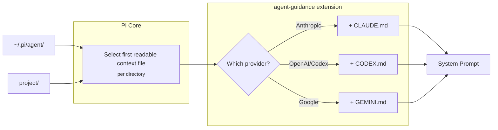

# pi-agent-guidance

Loads provider-specific context files (CLAUDE.md, CODEX.md, GEMINI.md) based on the current model, supplementing Pi's selected context files.

## How it works



| Provider | File |
|----------|------|
| Anthropic | CLAUDE.md |
| OpenAI / Codex | CODEX.md |
| Google | GEMINI.md |

### Pi Core behavior

Pi Core selects the first readable regular file per directory in this order:
`AGENTS.override.md`, `AGENTS.md`, `AGENTS.MD`, `CLAUDE.md`, `CLAUDE.MD`.
It searches the agent directory and project ancestors (walking up from cwd).
An override replaces only the context file in its own directory; unreadable
files and directories are skipped.

### What this extension adds

For each directory, loads a readable provider-specific regular file unless its
resolved path or content already appears in the host's actual
`before_agent_start.systemPromptOptions.contextFiles`. This includes custom host
context selections. A `CLAUDE.md` alongside a different `AGENTS.override.md` is
still Claude-specific guidance, and an unselected `AGENTS.md` cannot suppress a
matching `CODEX.md`. On older hosts without structured prompt options, the
fallback uses the same precedence and readability rules.

## Install

### Pi package manager

```bash
pi install npm:@signalridge/pi-agent-guidance
```


Then filter to just this extension in `~/.pi/agent/settings.json`:

```json
{
  "packages": [
    {
      "source": "npm:@signalridge/pi-agent-guidance",
      "extensions": ["./agent-guidance.ts"]
    }
  ]
}
```

### Local clone (setup script)

```bash
./setup.sh
```

Links the extension to `<agent-dir>/extensions/` and helps you set up
`<agent-dir>/AGENTS.md`. The agent directory defaults to `~/.pi/agent`; set
`PI_CODING_AGENT_DIR` to use another profile. A leading `~` or `~/` is expanded
as it is by Pi. Configuration and provider files belong in the same directory.

## Templates

`templates/` ships provider **context files**, not Agent Skills: they are plain guidance
Pi concatenates into the system prompt, so they carry no skill frontmatter and are
deliberately absent from this package's `pi.skills`.

Starter templates in `templates/`:
- `CLAUDE.md` - Claude-specific guidelines
- `CODEX.md` - OpenAI guidelines: `<solution_persistence>` (bias for action, persist till the task is done) and `<validation>` (run tests/lint/typecheck/build before summarizing or committing)
- `GEMINI.md` - Gemini guidelines: `<tool_usage_rules>` steering the model to pi's `read`/`write`/`edit` tools instead of `cat`/`heredoc`/`sed -i`/etc.

Install with:
```bash
ln -s "$(pwd)/agent-guidance/templates/CLAUDE.md" ~/.pi/agent/
```

## Configuration (optional)

Create `~/.pi/agent/agent-guidance.json`:

```json
{
  "providers": { "anthropic": ["CLAUDE.md"] },
  "models": { "claude-3-5*": ["CLAUDE-3-5.md"] }
}
```

## Changelog

See `CHANGELOG.md`.
